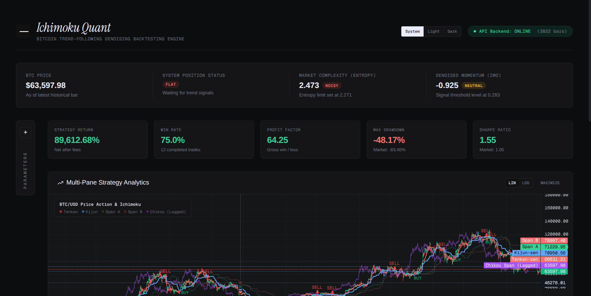
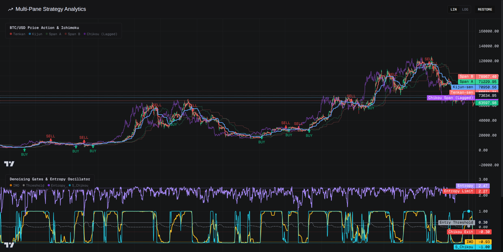
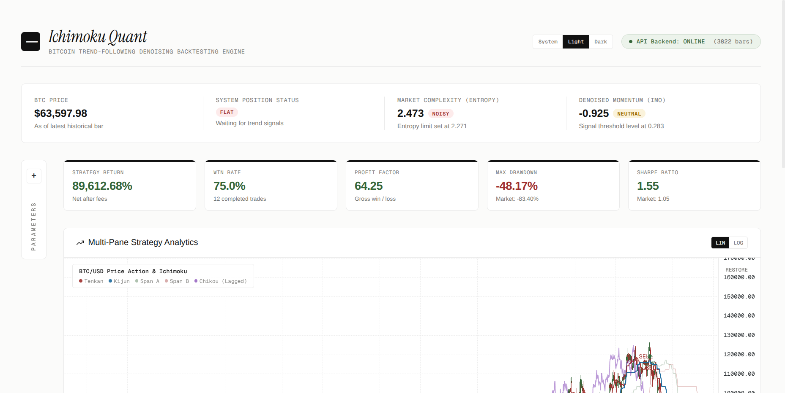
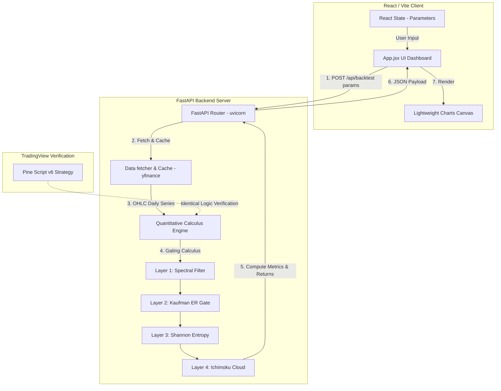

# Ichimoku Quantitative Optimization & Strategy System

[](https://github.com/lutfi-zain/ichimoku)
[](https://github.com/lutfi-zain/ichimoku)
[](https://github.com/lutfi-zain/ichimoku)
[](https://github.com/lutfi-zain/ichimoku)

A rigorous mathematical and algorithmic system designed to quantify and optimize the traditional Ichimoku Kinko Hyo trading system for Bitcoin trend-following. By translating subjective visual lines into normalized, stationary mathematical features, the strategy eliminates trading noise and lag.

> [!NOTE]
> This system is built using the **4-Layer Development Framework** from the `lz-technical-indicator-architect` methodology, stacking four distinct indicator families to filter market noise without adding execution lag.

---

## 📸 Dashboard Preview

### Sleek, Data-Dense Obsidian Ledger Theme


### Synchronized Multi-Pane Analytics (Maximized View)


### Price Chart & Execution Signal Focus (Maximized View)


---

## 🏗️ Multi-Principle Gating Framework

The trading system filters raw signals through four sequential mathematical gates to avoid whipsaws:

```
                      ┌────────────────────────────────┐
                      │    Layer 1: INPUT PROCESSING   │
                      │ Ehlers SuperSmoother Filter    │
                      └───────────────┬────────────────┘
                                      ▼
                      ┌────────────────────────────────┐
                      │    Layer 2: FRACTAL GATING     │
                      │   Kaufman Efficiency Ratio     │
                      └───────────────┬────────────────┘
                                      ▼
                      ┌────────────────────────────────┐
                      │   Layer 3: INFORMATION THEORY  │
                      │   Shannon Entropy Noise Gate   │
                      └───────────────┬────────────────┘
                                      ▼
                      ┌────────────────────────────────┐
                      │    Layer 4: TREND BOUNDARY     │
                      │      Ichimoku Cloud Gate       │
                      └───────────────┬────────────────┘
                                      ▼
                      ┌────────────────────────────────┐
                      │    Layer 5: SIGNAL GENERATION  │
                      │    Confirmation & Exit Logic   │
                      └────────────────────────────────┘
```

1. **Layer 1: Spectral Filtering (Ehlers SuperSmoother)**
   * Removes high-frequency noise from raw price indicators using a 2-pole Infinite Impulse Response (IIR) filter without adding the lag associated with moving averages.
2. **Layer 2: Fractal Family (Kaufman Efficiency Ratio)**
   * Measures trend efficiency (Net Displacement / Sum of Absolute Daily Changes). Entry signals are blocked if the market is consolidating/mean-reverting ($ER < 0.25$).
3. **Layer 3: Entropy & Information Family (Shannon Entropy)**
   * Computes the rolling randomness of return distributions. If return sequences are highly chaotic ($Entropy > 2.271$), entry signals are blocked to prevent noise execution.
4. **Layer 4: Smoothing & Regression (Ichimoku Cloud Gate)**
   * Price must trade above the bottom of the Ichimoku Cloud ($Close_t \ge \min(SpanA_t, SpanB_t)$). This prevents catching falling knives during bearish downtrends.

---

## 🖥️ System Architecture

The project features a decoupled, high-performance architecture separating local calculation models, local APIs, and a hardware-accelerated charting interface:



* **Frontend Engine**: Built with React, Vite, and Lightweight Charts. Supports dynamic scale adjustment (`LIN` / `LOG`), full-screen responsive maximization, theme switching (System, Light, Dark), and pixel-perfect touch indicators.
* **Backend Server**: Powered by FastAPI, delivering sub-100ms backtest computation from vectorized Pandas/NumPy routines.
* **Algorithmic Consistency**: Complete parameter equivalence between Python local testing and TradingView Pine Script v6 scripts.

---

## 📈 Performance Summary (10-Year Backtest)

The backtest runs on Bitcoin daily OHLC data from **2016 to 2026** (using 2015 data for indicator warm-up) with a transaction cost constraint of **0.1% per trade** (10 bps slippage/commission).

| Metric | Buy & Hold BTC | Baseline Strategy (No Entropy Gate) | Fully Denoised (Entropy + Cloud Gate) |
| :--- | :--- | :--- | :--- |
| **Total Return (%)** | 20,009.78% | 76,052.90% | **109,368.07%** |
| **Annualized Return (%)** | - | 70.38% | **73.37%** |
| **Annualized Volatility (%)** | - | 50.10% | **49.75%** |
| **Max Drawdown (%)** | -83.40% | -48.54% | **-48.17%** |
| **Sharpe Ratio** | 1.03 | 1.40 | **1.47** |
| **Total Trades** | 1.0 | 18.0 | **14.0** *(22% lower fee friction)* |

---

## 📁 Repository Structure

```text
ichimoku/
├── pyproject.toml              # Poetry packaging & dependencies
├── main.py                     # CLI helper / pipeline script
├── src/
│   ├── cli.py                  # Command line interface
│   └── ichimoku_quant/         # Core package
│       ├── __init__.py
│       ├── data.py             # Caching data fetcher
│       ├── features.py         # Rolling formula math
│       ├── strategy.py         # Signal logic loops
│       ├── backtest.py         # Backtest runner & metrics
│       ├── server.py           # FastAPI backend server
│       └── visuals.py          # Plotly HTML rendering
├── web/                        # React / Vite frontend
│   ├── package.json
│   ├── src/
│   │   ├── App.jsx             # React dashboard
│   │   ├── index.css           # Responsive obsidian styling
│   │   └── main.jsx
│   └── index.html
├── docs/                       # Visual assets & screenshots
└── research/                   # Parameter optimization, tuning & scripts
```

---

## 🚀 Getting Started

### 1. Setup Backend Environment
Ensure you have Python 3.10+ installed.

```bash
# Clone the repository
git clone https://github.com/lutfi-zain/ichimoku.git
cd ichimoku

# Install backend dependencies using Poetry
poetry install
```

### 2. Setup Frontend Environment
Ensure you have Bun installed.

```bash
cd web
bun install
```

### 3. Running System Locally

* **Start Backend API Server:**
  ```bash
  poetry run python src/ichimoku_quant/server.py
  ```

* **Start Frontend Dev Server:**
  ```bash
  cd web
  bun run dev
  ```
  Open [http://localhost:5173](http://localhost:5173) in your browser.

* **Run Command-Line Backtest CLI:**
  ```bash
  # Run backtest with default start date
  poetry run python src/cli.py backtest --start 2015-01-01
  ```
