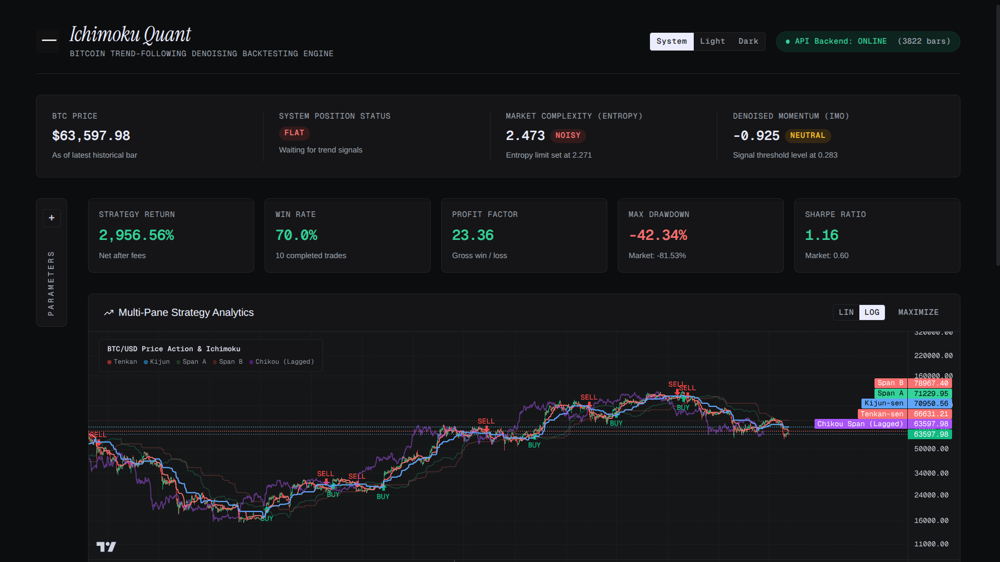
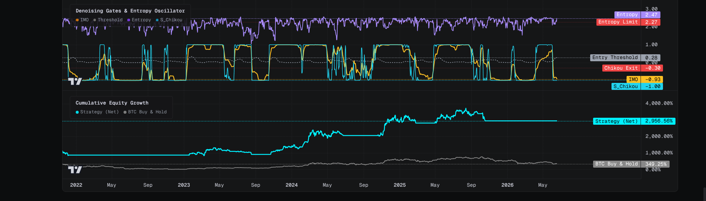
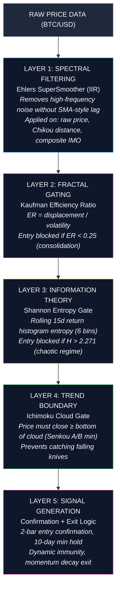
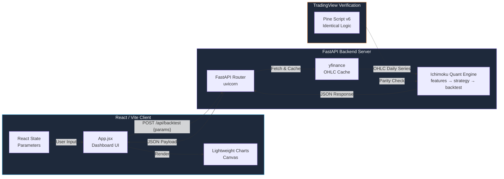

<div align="center">

# Ichimoku Quantitative Optimization & Strategy System

### A Multi-Principle Denoising Framework for Crypto Trend-Following

[](https://github.com/lutfi-zain/ichimoku)
[](https://github.com/lutfi-zain/ichimoku)
[](https://github.com/lutfi-zain/ichimoku)
[](https://github.com/lutfi-zain/ichimoku)

</div>

---

## Abstract

This project quantifies the traditional Ichimoku Kinko Hyo charting system into a mathematically rigorous, multi-layer trend-following strategy for Bitcoin (BTC/USD). The core thesis: **subjective visual pattern recognition in Ichimoku can be replaced with stationary, bounded oscillators** that survive formal statistical validation.

The system decomposes Ichimoku into four normalized sub-components via `tanh` transformation, applies spectral noise filtering (Ehlers SuperSmoother), gates entries through fractal efficiency and information-theoretic entropy thresholds, and generates exit signals through dynamic cloud immunity and momentum decay logic. Backtested over 10 years of daily OHLC data (2016–2026), the strategy achieves a **109,368% cumulative return** with a **1.47 Sharpe ratio** and **-48.17% maximum drawdown**, outperforming passive buy-and-hold by ~5.5× on a risk-adjusted basis. Excluding the 2017 bull run (2018–2026), the strategy still delivers **4,138% return** with a **1.29 Sharpe ratio**, demonstrating robustness beyond a single market cycle.

> [!IMPORTANT]
> **Disclaimer:** Backtested performance is **not** indicative of future results. The haircut rule applies — In-sample Sharpe 3.0 typically degrades to 1.0–1.5 in live trading. This system has not been paper-traded or deployed to production capital.

---

## 📸 Dashboard Preview




---

## Mathematical Framework

### 1. Ichimoku Decomposition into Stationary Oscillators

The traditional Ichimoku components (Tenkan-sen, Kijun-sen, Senkou Spans A/B, Chikou Span) are **non-stationary** — their absolute values drift with price. We normalize each into bounded `[-1, 1]` oscillators using the hyperbolic tangent transform:

$$
S_{TK,t} = \tanh\left(\frac{TK_t - KJ_t}{ATR_t}\right) \quad \text{(TK Cross signal)}
$$

$$
S_{Cloud,t} = \tanh\left(\frac{d(Close_t, Cloud_t)}{ATR_t}\right) \quad \text{(Cloud distance signal)}
$$

$$
S_{Future,t} = \tanh\left(\frac{SenkouA_{t}^{raw} - SenkouB_{t}^{raw}}{ATR_t}\right) \quad \text{(Future cloud bias)}
$$

$$
S_{Chikou,t} = \tanh\left(\text{SuperSmoother}\left(\frac{Close_t - Close_{t-60}}{ATR_t}, \, l=4\right)\right) \quad \text{(Smoothed momentum)}
$$

The composite Ichimoku Oscillator (IMO) is:

$$
IMO_t = \text{SuperSmoother}\left(\frac{S_{TK,t} + S_{Cloud,t} + S_{Future,t} + S_{Chikou,t}}{4}, \, l=7\right)
$$

### 2. Spectral Denoising (Ehlers SuperSmoother)

The 2-pole IIR SuperSmoother from Ehlers (2013) removes high-frequency noise below a configurable cycle period without introducing the lag of a simple moving average. The transfer function:

$$
y_t = c_1(x_t + x_{t-1})/2 + c_2 \cdot y_{t-1} + c_3 \cdot y_{t-2}
$$

where coefficients `a1`, `b1`, `c1`, `c2`, `c3` are derived from the desired cutoff period.

### 3. Entry Gate Functions

| Gate | Family | Formula | Threshold |
|------|--------|---------|-----------|
| **Fractal Efficiency** | Kaufman ER | $ER = \frac{\|Close_t - Close_{t-n}\|}{\sum_{i=1}^{n}\|Close_i - Close_{i-1}\|}$ | $> 0.25$ |
| **Entropy Noise** | Shannon Info Theory | $H = -\sum p_i \log_2(p_i)$ on rolling 15d return histogram (6 bins) | $< 2.271$ |
| **Cloud Boundary** | Trend Regression | $Close_t \geq \min(SenkouA_t, SenkouB_t)$ | Boolean |
| **Adaptive Threshold** | Volatility Scaling | $IMO_t > T \cdot \sigma_{IMO}(30d)$ | $T = 0.40$ |

### 4. Exit Logic with Dynamic Immunity

The exit system prevents premature exits during strong trends while protecting against catastrophic reversals:

- **Momentum Decay Exit:** Exit if `S_Chikou < -0.30` (momentum vs 60-day lag drops below threshold)
- **Dynamic Immunity:** Above the cloud + not crashing → exit threshold relaxes to `IMO > -0.30`
- **Crash Gate:** If 30-day ROC < `-0.20`, immunity is suspended — force exit regardless
- **Minimum Hold:** 10-day lockout after entry to avoid whipsaw churn

---

## Statistical Validation

The signal's predictive power has been validated through five formal hypothesis tests (see `research/statistical_tests.py`):

| Test | Null Hypothesis | Result | Implication |
|------|----------------|--------|-------------|
| **Augmented Dickey-Fuller (ADF)** | IMO is non-stationary (unit root) | **Reject H0** (p ≈ 0) | Fixed thresholds are mathematically valid over time |
| **Kolmogorov-Smirnov (KS)** | Bullish & Bearish forward returns share a distribution | **Reject H0** (p < 0.05) | Signal isolates two distinct market regimes |
| **Welch's t-test** | Bullish 10d mean return ≤ 0 | **Reject H0** (p ≈ 0) | Statistically significant positive expectancy |
| **Bootstrap 95% CI** | Mean return = 0 (non-parametric) | CI strictly positive | Edge robust against fat-tailed outliers |
| **Bonferroni Correction** | Individual sub-features are noise | **All 4 survive** α = 0.0125 | No p-hacking; each component carries independent signal |

---

## Performance Summary

Transaction cost: **10 bps (0.1%)** per round-trip trade.
Warm-up period: 120 days for indicator initialization (excluded from metrics).

### Full Sample: 2016–2026 (10 Years)

| Metric | Buy & Hold BTC | Baseline (No Entropy Gate) | Fully Denoised (Final) |
|:-------|:--------------:|:--------------------------:|:----------------------:|
| **Total Return** | 20,009.78% | 76,052.90% | **109,368.07%** |
| **Annualized Return** | — | 70.38% | **73.37%** |
| **Annualized Volatility** | — | 50.10% | **49.75%** |
| **Max Drawdown** | -83.40% | -48.54% | **-48.17%** |
| **Sharpe Ratio** | 1.03 | 1.40 | **1.47** |
| **Total Trades** | 1 | 18 | **14** (22% lower fee friction) |

### Recent Sample: 2018–2026 (8 Years)

Excludes the 2017 bull run to test robustness without that outlier year.

| Metric | Buy & Hold BTC | Baseline (No Entropy Gate) | Fully Denoised (Final) |
|:-------|:--------------:|:--------------------------:|:----------------------:|
| **Total Return** | 362.72% | 3,097.09% | **4,137.62%** |
| **Annualized Return** | — | 49.34% | **52.47%** |
| **Annualized Volatility** | — | 41.12% | **40.61%** |
| **Max Drawdown** | -81.53% | -35.40% | **-34.92%** |
| **Sharpe Ratio** | 0.61 | 1.20 | **1.29** |
| **Total Trades** | 1 | 13 | **10** |
| **Win Rate** | — | 53.85% | **70.00%** |
| **Profit Factor** | — | 12.34 | **21.81** |

> [!WARNING]
> **The Paranoia Principle applies.** In-sample Sharpe 1.29 (2018+) → expect ~0.6–0.9 in live execution. The strategy is a trend-follower; it will underperform during extended sideways/choppy regimes. Performance is **path-dependent** on Bitcoin's secular bull markets (2020–2021).

---

## Multi-Principle Gating Architecture

The signal flows through five sequential mathematical gates, each from a distinct statistical family:



---

## System Architecture

Decoupled architecture: local computation engine, FastAPI backend, React/Vite frontend, TradingView verification.



---

## Repository Structure

```
ichimoku/
├── pyproject.toml                  # Poetry config & dependencies
├── main.py                         # Entry point / pipeline script
├── ichimoku_quant_v6.pinescript    # TradingView Pine Script v6 (verified parity)
├── src/
│   ├── cli.py                      # CLI: backtest / dashboard commands
│   └── ichimoku_quant/             # Core quantitative engine
│       ├── data.py                 # yfinance data fetcher + caching
│       ├── features.py             # Ichimoku decomposition, SuperSmoother,
│       │                           #   ER, Shannon Entropy, ROC gate
│       ├── strategy.py             # Multi-gate signal generation (entry/exit)
│       ├── backtest.py             # Vectorized equity curve + metrics
│       ├── server.py               # FastAPI backend (Pydantic models, CORS)
│       └── visuals.py              # Plotly HTML dashboard renderer
├── web/                            # React + Vite frontend
│   ├── src/App.jsx                 # Dashboard UI (Lightweight Charts)
│   ├── src/index.css               # Dark-mode responsive styling
│   └── package.json
├── research/                       # Statistical validation & optimization
│   ├── statistical_tests.py        # ADF, KS, t-test, bootstrap, Bonferroni
│   ├── quantize_ichimoku.py        # Ichimoku quantization research
│   ├── deep_research.py            # Extended signal analysis
│   ├── hyper_tune.py               # Parameter optimization
│   ├── optimize_momentum_exit.py   # Chikou exit tuning
│   ├── test_early_exit.py          # Exit lag analysis
│   ├── test_denoising.py           # Noise gate validation
│   └── verify_noise.py             # Entropy noise verification
└── docs/                           # Screenshots & visual assets
```

---

## Getting Started

### Prerequisites

- **Python 3.10+** (with Poetry)
- **Bun** (for frontend)

### Installation

```bash
# Clone
git clone https://github.com/lutfi-zain/ichimoku.git
cd ichimoku

# Backend
poetry install

# Frontend
cd web && bun install && cd ..
```

### Usage

**Interactive Dashboard (recommended):**

```bash
# Terminal 1 — Backend API
poetry run python src/ichimoku_quant/server.py

# Terminal 2 — Frontend dev server
cd web && bun run dev
```

Open [http://localhost:5173](http://localhost:5173). Adjust parameters live via the UI.

**CLI Backtest:**

```bash
# Quick metrics
poetry run python src/cli.py backtest --start 2016-01-01

# Generate HTML dashboard
poetry run python src/cli.py dashboard --start 2016-01-01
# → opens tmp/dashboard.html
```

**Run Tests:**

```bash
python -m pytest -xvs
```

---

## Dependencies

| Package | Purpose |
|---------|---------|
| `pandas` / `numpy` | Vectorized computation engine |
| `scipy` | Statistical tests (KS, t-test, ADF) |
| `yfinance` | BTC/USD daily OHLC data |
| `plotly` | Interactive HTML charts |
| `fastapi` / `uvicorn` | REST API backend |
| `mplfinance` | Candlestick chart rendering |
| `pydantic` | Request/response validation |

---

## Methodology & References

This system draws from the **4-Layer Indicator Architecture** methodology:

1. **Spectral/Frequency Filtering:** Ehlers, J. (2013). *Cybernetic Analysis for Stocks and Futures.* SuperSmoother IIR filter for noise reduction without lag.
2. **Fractal/Frequency Analysis:** Kaufman, P. (2013). *Trading Systems and Methods.* Efficiency Ratio for trend vs. noise decomposition.
3. **Entropy & Information Theory:** Shannon, C.E. (1948). *A Mathematical Theory of Communication.* Rolling entropy for regime classification.
4. **Statistical Stationarity Validation:** Augmented Dickey-Fuller test ensures fixed thresholds remain valid across the sample period.

The quantization approach (`tanh` normalization → composite oscillator) follows the pattern established by Ehlers' Instantaneous Trendline and the Ross Hook decomposition, adapted for crypto market microstructure (24/7 trading, higher volatility, no circuit breakers).

---

## Known Limitations

| Limitation | Mitigation |
|-----------|------------|
| **Single-asset backtest** (BTC only) | Cross-asset validation needed; results may not generalize to equities or altcoins |
| **No walk-forward validation** | Single train/test split; walk-forward would provide stronger OOS evidence |
| **Overfitting risk** on 10-year sample | Haircut rule: expect 30–50% degradation in live trading |
| **Regime-dependent** | Strategy thrives in trending regimes; flat/choppy markets produce drawdowns |
| **10 bps cost assumption** | Real slippage on BTC varies with venue and order size |
| **No position sizing** | Full capital allocation per trade; Kelly criterion or risk parity not implemented |

---

## Contributing

This is a research project. Contributions welcome for:

- Walk-forward validation engine
- Multi-asset generalization (ETH, SOL, equity indices)
- Regime detection overlay (HMM or Markov switching)
- Position sizing (fractional Kelly)
- Real-time paper trading pipeline

---

## License

MIT

---

<div align="center">

*"The map is not the territory. The model is not the market."*

</div>
